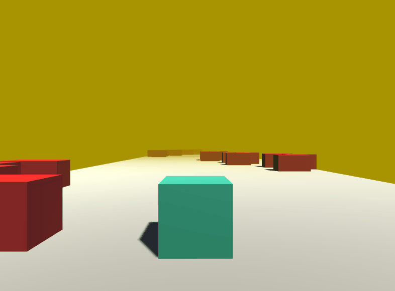

# Project

Cubler (a wordplay between Cube and Hurdler) is the first game I developed, a simple 3D game produced with Unity, for better understanding of Game Engines. 

## Redistribution

__As this repository uses Git LFS, downloading it as a zip will not work!__

* Download [Git](https://git-scm.com/). 
* Install via command line in your desired directory as: { git clone https://github.com/Zai-shen/Cubler.git . }.
* Go to \Builds\Windows\x86_64 and execute Cubler.exe.

## Contributors

[Zaishen](https://github.com/Zai-shen)

### Tech stack

* [Unity](https://unity.com/)
* [C#](https://docs.microsoft.com/en-us/dotnet/csharp/)
* [Git](https://git-scm.com/)
* [Github](https://github.com/)

### Inspiration

Brackeys tutorials and simple but beatiful hyper-casual games.
